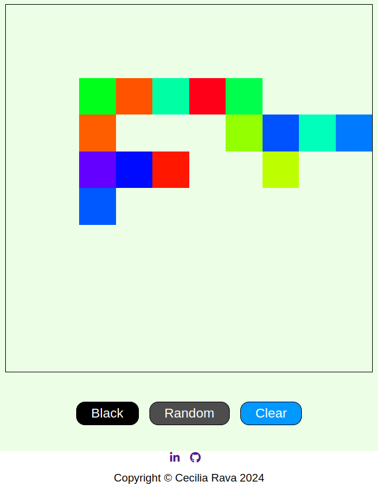

# Sketchpad

This is a simple sketchpad application developed as part of The Odin Project curriculum. The sketchpad allows users to draw on a grid by moving their mouse over it. You can customize the grid size and colors, making it a fun and interactive way to create digital drawings.

## Features

- **Interactive Drawing**: Draw by hovering your mouse over the grid cells.
- **Customizable Grid Size**: Adjust the size of the grid to your preference.
- **Color Selection**: Choose between black and random colors for drawing.
- **Clear Board**: Reset the board to start a new drawing.

## How to Use

1. **Select Size**: Click the "Select" button to choose the size of the grid.
2. **Choose Color**: Click the "Black" button for black color or the "Random" button for random colors.
3. **Draw**: Hover over the grid cells to draw.
4. **Clear Board**: Click the "Clear" button to reset the board.

## Technologies Used

- **HTML**
- **CSS**
- **JavaScript**

## Demo

You can view a live demo of the project [here](https://github.com/CeciliaRava1).

## Screenshot



## Setup

1. Clone the repository:
    ```bash
    git clone https://github.com/CeciliaRava1/sketchpad.git
    ```
2. Open `index.html` in your browser to view the sketchpad.

## Author

- **Cecilia Rava**
    - [LinkedIn](https://www.linkedin.com/in/cecilia-r-127779246/)
    - [GitHub](https://github.com/CeciliaRava1)
